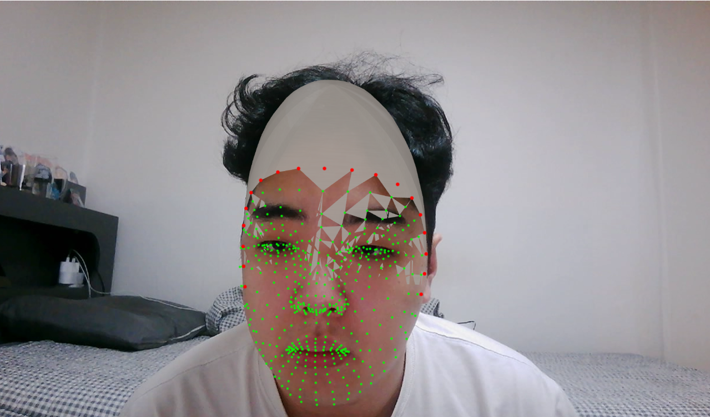
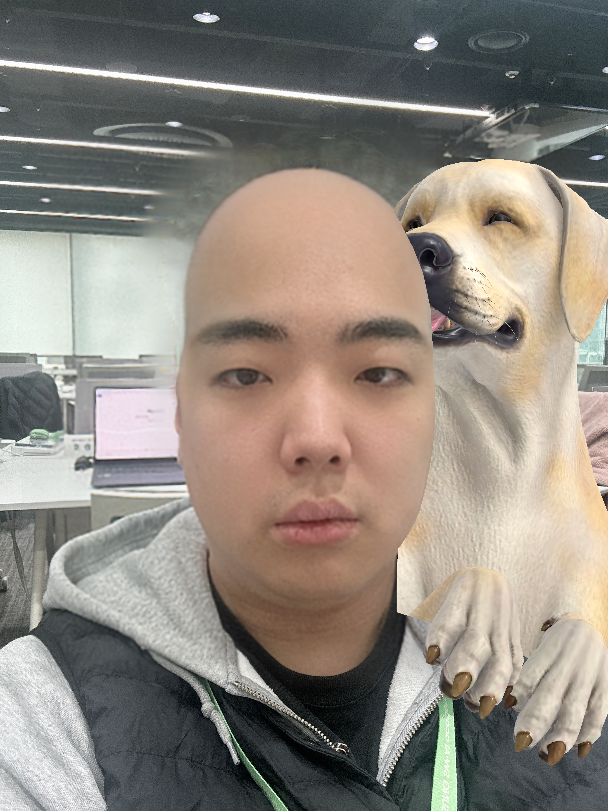

## 현재 문제점
- 사용자가 카메라에 인식시 자동으로 머리스타일 지우고 대머리로 만들어야 하는데 이 과정이 잘 이루어지지 않습니다.

## 대머리화가 필요한 이유
- 사용자가 헤어스타일 선택시 현재 사용자의 헤어스타일보다 짧은 머리스타일을 고를 경우 새로운 헤어스타일을 적용해도 기존 머리스타일이 튀어나와 보기 좋지 않습니다.

## 대머리화를 위해 시도한 방법
- 프론트내에서 mediapipe를 사용하여 실시간으로 대머리처리를 시도하고 있었습니다.
- 시도한 로직
1. mediapipe를 활용하여 얼굴의 470~480개의 랜드마크를 확보
2. 확보된 랜드마크에 FACEMESH_FACE_OVAL를 사용하여 사용자 얼굴의 외곽 랜드마크를 활용하여 위치를 잡고 둘레와 구형태를 생성하여 사용자의 두상을 3d로 구현하려고 하였습니다.
    - 여기서 1차로 3D가 잘되지 않아 2D로라도 구현된 모습입니다.

3. MediaPipe Image Segmentation를 사용하여 헤어 인식
4. 인식된 헤어를 자연스럽게 삭제하려고 하였으나. 머리카락 삭제 후 뒷배경 위치를 어떻게 처리해도 어색한 상황입니다.
.png>)

## 프론트에서 처리하려고 한 이유
1. 대머리화를 실행하는 시점은 사용자가 헤어스타일을 선택후 자신의 머리에 실시간으로 오버레이 되는순간입니다.
    -> 그렇다면 최대한 이질감 없이 사용자의 머리에 적용하기 위해선 프론트에서 처리해야 실시간 사용에 유리하다고 판단했습니다.
2. 유사 서비스 중 스노우카메라어플에 대머리 필터를 입히는 기능이 있는데 실시간을 굉장히 잘 따라와서 기술적으론 이론상 충분히 구현 가능하다고 판단했는데 무리였던것 같습니다...

## 대체 방안
- 배경화면을 흰색이나 다른색을 줘서 기존 헤어를 없앴을때의 어색함 줄이기
- 대머리화까지 AI서버에서 활성화하여 같이 보내주기